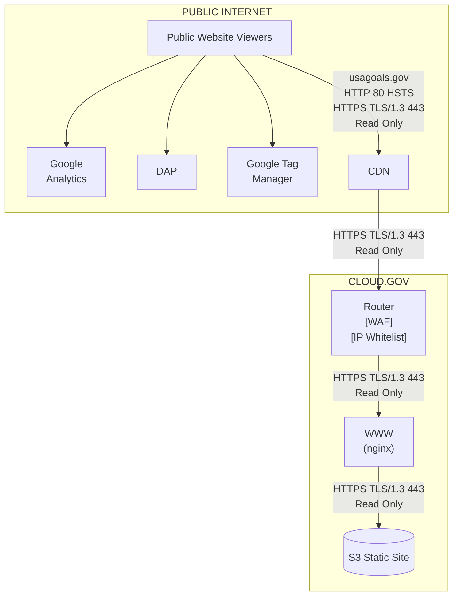

### Public User Viewing Site

```mermaid
graph TD
    subgraph "PUBLIC INTERNET"
        PublicWebsiteViewers["Public Website Viewers"]
        GAN["Google<br/>Analytics"]
        DAP["DAP"]
        GTM["Google Tag<br/>Manager"]
        CDN["CDN"]
        
        PublicWebsiteViewers --> GAN
        PublicWebsiteViewers --> DAP
        PublicWebsiteViewers --> GTM
        PublicWebsiteViewers --> |"usagoals.gov<br/>HTTP 80 HSTS<br/>HTTPS TLS/1.3 443<br/>Read Only"| CDN
    end

    subgraph "CLOUD.GOV"
        DB[("S3 Static Site")]
        WWW["WWW<br/>(nginx)"]
        Router["Router<br/>[WAF]<br/>[IP Whitelist]"]
        
        WWW --> |"HTTPS TLS/1.3 443<br/>Read Only"|DB
        Router --> |"HTTPS TLS/1.3 443<br/>Read Only"|WWW
    end
    
    CDN --> |"HTTPS TLS/1.3 443<br/>Read Only"|Router
```