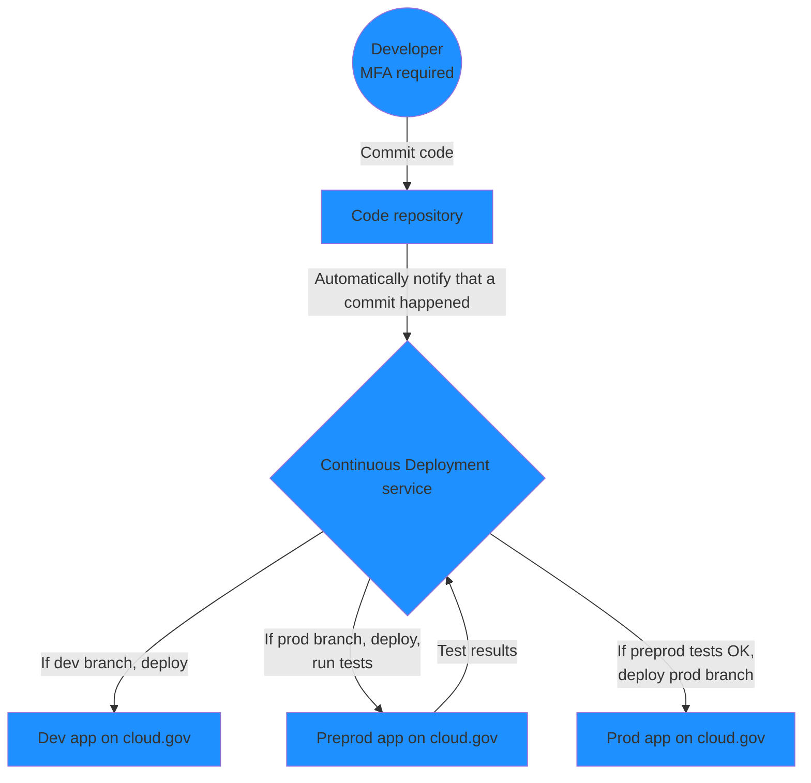

### Code Workflow for Continuous Deployment

```mermaid
graph TD
    A((Developer<br/>MFA required)) -- Commit code --> B[Code repository]
    B -- Automatically notify that a commit happened --> C{Continuous Deployment service}
    C -- If dev branch, deploy --> D[Dev app on cloud.gov]
    C -- If prod branch, deploy,<br/>run tests --> E[Preprod app on cloud.gov]
    E -- Test results --> C
    C -- If preprod tests OK,<br/>deploy prod branch --> F[Prod app on cloud.gov]

    style A fill:#1e90ff
    style B fill:#1e90ff
    style C fill:#1e90ff
    style D fill:#1e90ff
    style E fill:#1e90ff
    style F fill:#1e90ff
```